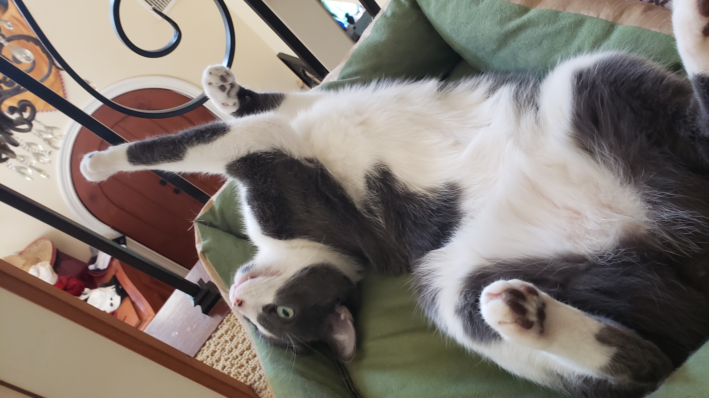

# This is a header for the front page of the website

This is an introduction to the website, and what it's mostly going to be about. We don't need it to be super complicated, it only needs to make sense.

## This is a subheader

Now we go into more specifics into what we mean and what we're doing. Perhaps present stuff about our testing and how that went. I suspect we should also put links to the datasets we used here too.

[This is a link to the codenames repository](https://github.com/XueweiYan/codenames-game-ai)

### This would be where we list some steps of how we did it or how we developed the algorithm or some shit

- These are now bulleted lists
- this is part of a bulleted list
