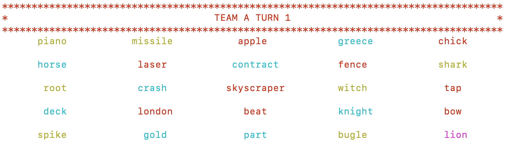
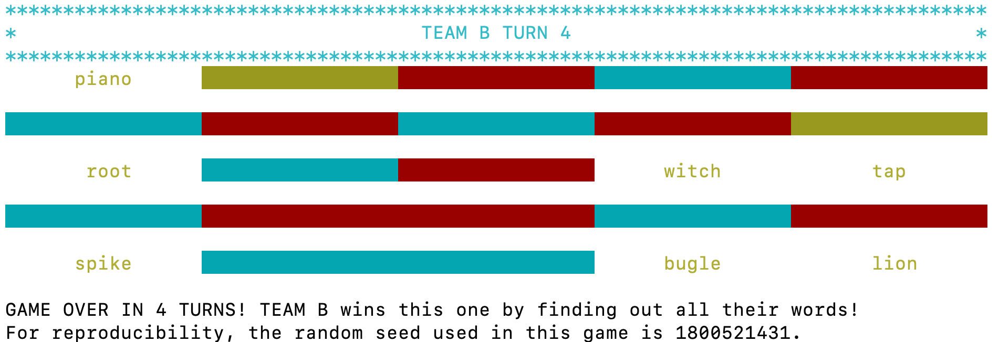
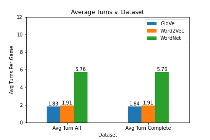
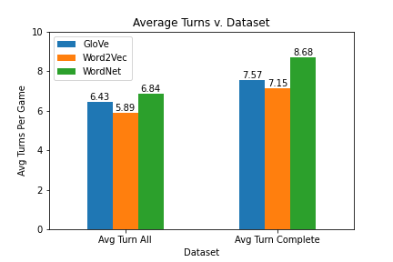
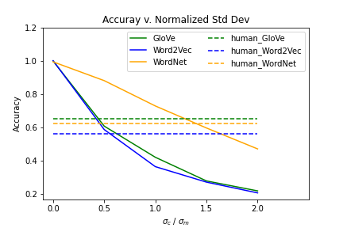

# The Codenames AI
## by Yongqing Li, Xuewei Yan, and Cameron Shaw

## What is Codenames?

Codenames is a board game with a fairly simple premise, guessing words. There are two teams and one board. On the board, there is a 5 by 5 grid of words chosen from a predetermined pool. Each word is designated either an agent word, a neutral word, or an assassin word. The objective for both teams is to guess their respective set of agent words.

Each team has a set of agent words that they have to guess on the board. In order to help the teams guess the correct word, each team has one designated Spymaster, who can see the entire board and can also see what words their team must guess to win.

The rest of the team, the Field Agents, or Guessers, don't know which words on the board are theirs. Thus, since the Spymaster can't tell the Field Agents exactly what words the Field Agents must guess, the Spymaster has to provide their team a hint. Using the Spymaster's hint, the Field Agents then have to guess which words on the board are theirs. Once a word has been guessed, that word is removed from the field. Both teams repeat this until one team has guessed their words or a team guesses the assassin word. If a team guesses the assassin word, that team immediately loses.

## Our AI

Our AI is written to simulate both a Guessing role and Spymaster role. The AI was designed and tested with both AI only teams and AI/Human teams in mind. Using a dataset with 30 thousand words, built from some of the most common words from Wikipedia's database. With these datasets, we created vector embeddings from the dataset and then trained our AI to use 3 different ways of viewing the relationships between those words in order to play the game. We used Word2Vec, GloVe and Wu-Palmer similarity for the AI's relationships between words. Each of these is a separate way to view similarities between words, and in our testing we found that each of these similarities provides a different gameplay experience for Human/AI teams. This is the knowledge base for the AI, and the player can choose between each knowledge base at the beginning of the game.

Given its knowledge base, the AI Spymaster then compares one of its teams' words to its knowledge base, and then gives the hint it believes best fits the words it intends the Agents to guess. For an only AI team, this process is incredibly efficient. Since both the Agents and Spymaster has exactly the same knowledge base, the AI team can guess words nearly perfectly every time. They are effectively the same person doing both roles. Though we have added a necessary component of randomness in this setup, so the AIs won't guess perfectly 100% of the time.

When we tested the AIs against AIs, one of the metric we took was the number of turns the AI took to finish a game per dataset.

Where there is less certainty in performance is when the AI is forced to deal with a human teammate. Due to the difference in knowledge and thought process between the bot and a human, we had to design the bot to change strategies with a human teammate. An AI Spymaster has to give hints that are more obviously related to the words on the board, and an AI Agent has to be more accurate and conservative with its guesses. Thus, the weights for hinting and guessing certain words are different with a human teammate, it has to compensate for the difference in thought process. Fine tuning the various hyper-parameters required for understandable AI/Human interaction took the longest out of this entire project.

## How we did it

After creating the framework for the relatively simple game rules, the framework for the AI's processes was swiftly created. We tested this early versions of the AI using a few algorithms trained on several datasets. A few algorithms had to be scrapped when other strategies turned out to outperform them entirely, and we eventually settled on using the most common words on Wikipedia dataset. The size of the dataset for the AI's knowledge base and most efficient algorithm was decided by testing it on a large amount of AI vs AI games, and measuring how swiftly the bots finished games for each combination of setups. Testing resulted in our final 30 thousand word dataset being chosen, since it was the most efficient for the least amount of storage space, and our final algorithm was chosen after it outperformed all of the other contenders. Since the three similarity calculations were so close, we decided to allow the player to decide between them, and decide which best suited their thought process.

We tested the number of turns our human tests took to finish in order to compare datasets.

## What we learned

Our main takeaway for this project has been twofold. The first is that creating a AI teammate for a game about word relationships is very much possible. The performance of our bot is very good for the relatively simple rules of this game, and given time, could be expanded into a more complex implementation of Codenames. Secondly, the creation of an AI for an examination of relationships between words using vector embeddings and similarities may not be the most efficient way to achieve this result. While our AI does achieve good scores for Human/AI interaction, it is not as accurate as a full Human team, nor is it as efficient as a full AI team. With the difficulties we had in adjusting the hyperparameters for this strategy to allow for functional Human/AI interaction, we believe using other strategies to achieve the same result would be more effective at simulating the thought process of a human mind when it comes to Codenames.

We compared our human and AI accuracies and standard deviations to observe how well our human tests did compared to the AI tests.

If you'd like to see run the analysis and testing for this project, go to this *[Github repository](https://github.com/YongqingLi14/codenames-ai-analysis)*.

If you'd like to play the game, go to this *[repository](https://github.com/XueweiYan/codenames-game-ai)*.
